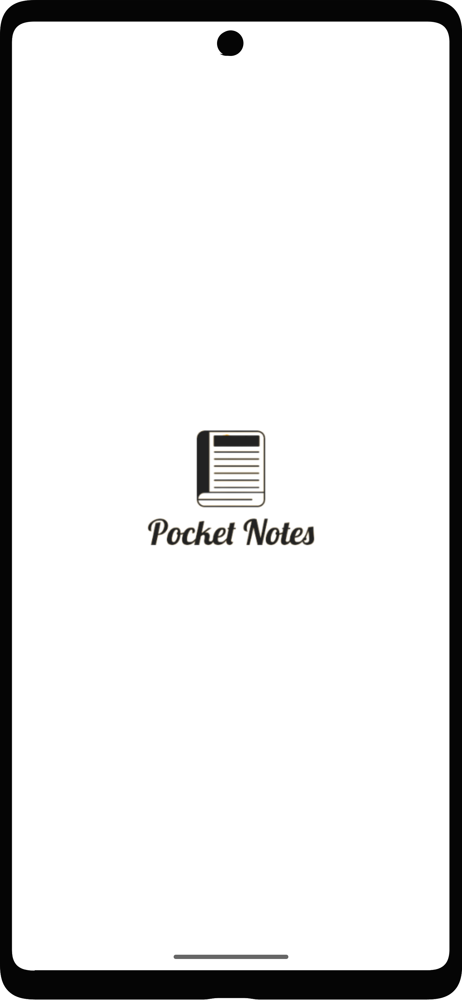
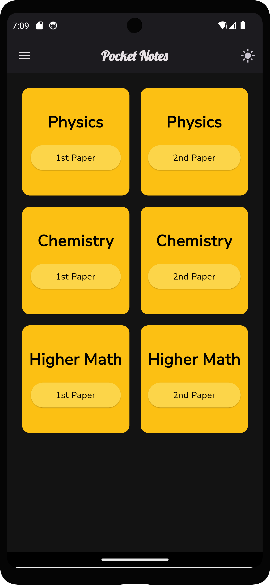
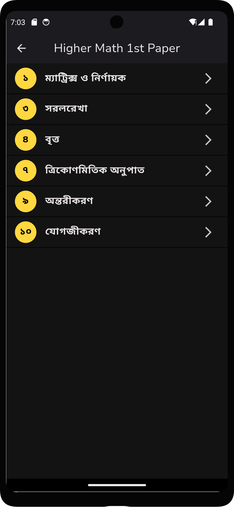
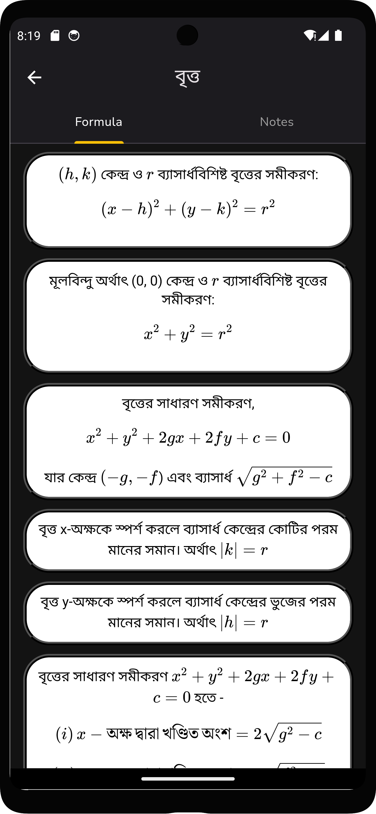
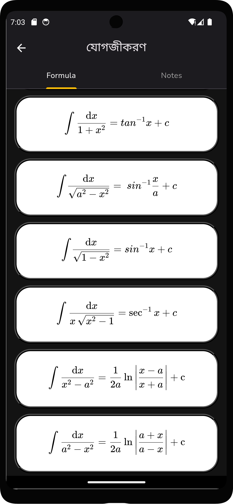

# Pocket Notes [WIP]

An app I wrote for personal use, allowing me to access formulas conveniently while on the move, eliminating the need to carry physical books and notes.

## Future release
I believe this app could prove beneficial for HSC and Admission candidates, so I'm considering publishing it on the Play Store. However, before doing so, I intend to enhance the app to provide a smoother user experience, as the current user interface looks kinda garbage TBH. This project is made using the Flutter framework

## Screenshots

  
  

  
  

